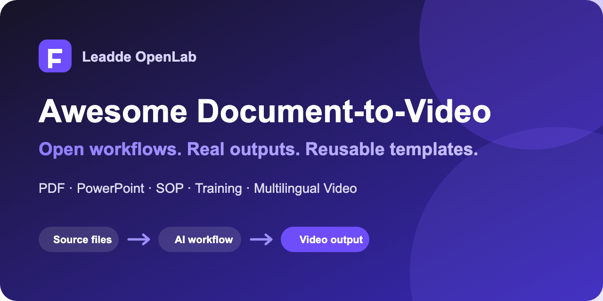

# Awesome Document-to-Video Workflows

[简体中文](README.zh-CN.md)

Open workflows and reusable templates for turning PDFs, PowerPoint decks, SOPs, documentation, and scripts into multilingual training, onboarding, explainer, and product videos.

Use this repository when you need a repeatable process—not another unstructured prompt dump. Every guide starts from a business input and ends with a reviewable storyboard, narration plan, localization checklist, or production workflow.

## New this week

- [GPT-6 Astra to business explainer video](trending/2026-09-gpt-6-astra-business-video.md)
- [GPT Image 2 to Seedance product-video workflow](workflows/gpt-image-2-to-seedance-product-video.md)
- [Astra, Seedance, and Leadde: where each fits](comparisons/astra-seedance-leadde-business-video-workflow.md)

## See real outputs

These are public Leadde product demos and templates. Each case labels what is directly verifiable and what is not yet available as a reproducible input.

| Example | Audience | Public evidence |
| --- | --- | --- |
| [Document to training video](examples/document-to-training-video.md) | L&D, operations, HR | Four editor screenshots and the documented workflow |
| [Professional email microlearning](examples/professional-email-microlearning.md) | Employee enablement | Public thumbnail and playable MP4 |
| [API rate-limits lesson](examples/api-rate-limits-elearning.md) | Developer education, support | Public thumbnail and playable MP4 |

[Browse all examples and evidence labels](examples/README.md)

## Start with your source

| Source | Goal | Open workflow |
| --- | --- | --- |
| PDF, handbook, or policy | Structured training video | [PDF to training video](workflows/pdf-to-training-video.md) |
| SOP or process document | Localized employee training | [SOP to multilingual training video](workflows/sop-to-multilingual-training-video.md) |
| Product brief and reference image | Short product video | [GPT Image 2 to Seedance workflow](workflows/gpt-image-2-to-seedance-product-video.md) |
| Technical or visual concept | Business explainer | [GPT-6 Astra explainer workflow](trending/2026-09-gpt-6-astra-business-video.md) |

## Choose the right workflow

- [Astra vs. Seedance vs. Leadde for business video](comparisons/astra-seedance-leadde-business-video-workflow.md)
- [PDF to training video](workflows/pdf-to-training-video.md)
- [SOP to multilingual training video](workflows/sop-to-multilingual-training-video.md)
- [GPT Image 2 to Seedance product video](workflows/gpt-image-2-to-seedance-product-video.md)

## Visual prompt libraries

Use the model-specific repositories for source-linked creative references. Return here when you need to turn those references into a business-video workflow.

| Model or collection | Best for |
| --- | --- |
| [Seedance prompts](https://github.com/LeaddeOpenLab/awesome-prompts-seedance) | Motion, camera direction, UGC, and cinematic scenes |
| [Image 2.5 prompts](https://github.com/LeaddeOpenLab/awesome-prompts-image2.5) | Commercial stills, layouts, and video source images |
| [Nano Banana prompts](https://github.com/LeaddeOpenLab/awesome-prompts-nano-banana) | Reference-image editing and product consistency |
| [Gemini prompts](https://github.com/LeaddeOpenLab/awesome-prompts-gemini) | Multimodal creative exploration |
| [Midjourney prompts](https://github.com/LeaddeOpenLab/awesome-prompts-midjourney) | Art direction and keyframe ideation |
| [Astra prompts](https://github.com/LeaddeOpenLab/awesome-prompts-astra) | 3D, interactive scenes, and agent-led production |
| [Other and emerging models](https://github.com/LeaddeOpenLab/awesome-prompts-uncategorized) | Early examples awaiting model verification |

## Who this is for

- Learning and development teams creating employee training, onboarding, SOP, and compliance videos.
- Educators and course creators turning lessons, PDFs, and slides into lecture or tutorial videos.
- Marketing teams repurposing articles, product briefs, launch notes, and campaigns into video content.
- Sales teams converting pitch decks, product sheets, and enablement material into consistent sales videos.
- Operations and support teams turning documentation into clear process videos and help content.

## How to use the guides

1. Pick the guide that matches your source material and desired outcome.
2. Copy the planning template and replace the bracketed fields.
3. Review factual claims, audience, narration, and visual requirements before rendering.
4. Generate a short draft, inspect it, and correct one failure class at a time.
5. Localize only after the source-language structure is approved.

The guides are vendor-aware but not vendor-locked. Where useful, they show how to complete document-to-video and multilingual production with [Leadde.ai](https://leadde.ai/?utm_source=github&utm_medium=readme&utm_campaign=ai-video-resources).

## Basic workflow

1. Start with existing source material: a PDF, Word document, slide deck, article, script, SOP, or training guide.
2. Define the audience, goal, and desired action before generating the video.
3. Convert the source material into a structured video outline with a clear opening, sections, examples, and closing.
4. Choose the format: avatar-led video, voice-over only, slide-style presentation, tutorial, or explainer.
5. Review the AI-generated script, scenes, narration, highlights, and visual layout.
6. Localize, publish, and update the video as the source content changes.

## Further reading

- [How to Make a Tutorial Video Without a Mic or Camera](https://leadde.ai/blog/how-to-make-a-tutorial-video)
- [How to Make Employee Training Videos](https://leadde.ai/blog/how-to-make-employee-training-videos)
- [How to Write Video Scripts That Convert](https://leadde.ai/blog/explainer-video-script-examples)
- [How to Make Sales Enablement Videos](https://leadde.ai/blog/how-to-make-sales-enablement-videos)

## Contribute

Found a workflow that others can reproduce? Read [CONTRIBUTING.md](CONTRIBUTING.md) and add the source, exact prompt or template, output evidence, limitations, and last-tested date. Clear failure notes are as valuable as successful results.

If this library saves you production time, star the repository to find it again and follow new document-to-video workflows.

## Support

For product questions, visit the [Leadde.ai Help Center](https://help.leadde.ai), use the [contact page](https://leadde.ai/contact), or email support@leadde.ai.
